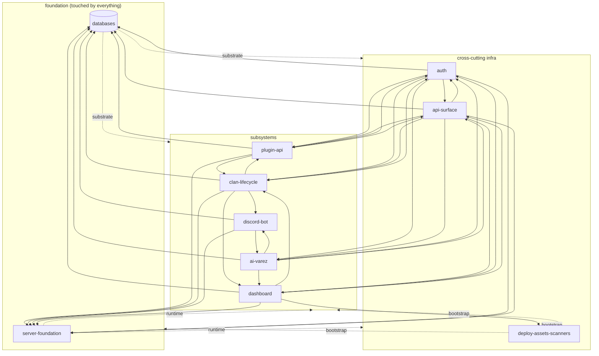

<div align="center">

# clansocket-app

**ClanSocket. Operational platform for OSRS clans.**

discord bot + dashboard SPA + express server. multi-tenant by clan. npm workspaces.

</div>

> this README is a working reference for developers inside `clansocket-app/`. it cross-links to deeper docs (design system, DNS map, plugin compliance) rather than duplicating them. when a claim here disagrees with the code, the code wins — patch this file.

---

## table of contents

- [orientation](#orientation)
- [architecture](#architecture)
  - [ripple graph](#ripple-graph)
  - [4d profile schema](#4d-profile-schema)
- [repository layout](#repository-layout)
- [setup](#setup)
- [subsystems](#subsystems)
  - [server foundation](#server-foundation)
  - [auth flows](#auth-flows)
  - [api surface](#api-surface)
  - [plugin api + telemetry + audit](#plugin-api--telemetry--audit)
  - [clan lifecycle](#clan-lifecycle)
  - [ai (varez)](#ai-varez)
  - [discord bot](#discord-bot)
  - [dashboard](#dashboard)
  - [databases](#databases)
  - [deploy + nginx + assets + scanners](#deploy--nginx--assets--scanners)
- [conventions and strictness](#conventions-and-strictness)
- [customization logic](#customization-logic)
- [troubleshooting](#troubleshooting)
- [where to find things](#where-to-find-things)

---

## orientation

`clansocket-app/` is one of three sibling projects inside the `D:/BanesLab/ClanSocket/` workspace. the workspace root is not a git repo — each sibling has its own `.git`.

| sibling | stack | role |
| --- | --- | --- |
| `clansocket-app/` | node monorepo (npm workspaces) | this project. bot + dashboard + server. |
| `clansocket-plugin/` | java / gradle, runelite plugin | OSRS client plugin. streams telemetry + clan chat. |
| `clansocket-docs/` | empty | placeholder for public docs site. |

cross-project contract: the plugin talks to this server over `wss://ws.clansocket.com/data` (telemetry) + `https://api.clansocket.com/api/clansocket/chat` (clan-chat HTTP ingest). server routes payloads to the right clan tenant by resolving the player's in-game clan name. full subdomain map at [`DNS.md`](./DNS.md).

---

## architecture

three runtimes, one repo:

<table>
<tr>
<td valign="top" width="33%">

### `main/discord/`
discord.js bot. commonjs. plugin auto-loader walks `src/plugins/{commands,slash,interactions,messages}` at boot. talks to the server over HTTP for AI bridge.

entry: `main/discord/src/main.js`

</td>
<td valign="top" width="33%">

### `main/dashboard/`
vite + typescript SPA. plain css, no preprocessor, no react/vue. rendering uses `dom/factory/` primitives. routing in `managers/router.ts` + `managers/deep-link.ts`.

entry: `main/dashboard/src/main.ts` → `src/app/index.ts`

</td>
<td valign="top" width="33%">

### `main/server/`
express 5 + typescript via `tsx`. https in dev (self-signed via mkcert), plain http behind nginx in prod. serves `dist/` in prod, returns 404 JSON on the api port in dev.

entry: `main/server/src/index.ts`

</td>
</tr>
</table>

**multi-tenant model.** every clan is its own tenant. site-wide tables live in `clansocket.db`. per-clan state lives under `data/clans/<clan-uuid>/{clan,clan_audit,plugin-<mode>}.db`. plugin frames are routed to the right tenant by `resolveOrCreateClan` (`main/server/src/data/app-helpers.ts:113`) from the player's in-game clan name.

### ripple graph

every subsystem ripples to others. edges below show *who breaks if i change my contract*. derived directly from the W axis of each subsystem's 4d profile (see [4d profile schema](#4d-profile-schema)).



**coupling intensity** (out-degree from the W axis):

| concern | out | role |
| --- | --- | --- |
| `deploy-assets-scanners` | 9 | integration boundary — deploy touches every concern |
| `databases` | 9 | substrate — schema change ripples to every reader |
| `server-foundation` | 9 | bootstrap — every router mounts here |
| `api-surface` | 7 | http surface — every consumer hits these endpoints |
| `clan-lifecycle` | 6 | multi-table writes + cascade-purge into every DB |
| `dashboard` | 6 | consumes every public surface |
| `auth` | 6 | gates the api, owns sessions, drives claim handshake |
| `ai-varez` | 5 | own DB + reads plugin DBs + bot bridge + dashboard SSE |
| `plugin-api` | 5 | ingests telemetry into clan + audit DBs |
| `discord-bot` | 3 | thinnest — only consumes AI bridge + server-bridged persistence |

### 4d profile schema

each subsystem section below carries a 4-axis profile:

| axis | what it measures |
| --- | --- |
| **X · surface area** | public touchpoints (endpoints, exported functions, ws event types, exposed dom hooks). bucketed S/M/L/XL. |
| **Y · internal depth** | abstraction layers between entry and persistent side effect. expressed as a depth count + chain example. |
| **Z · state weight** | what persistent state the concern owns (DB tables, fs paths, in-mem caches that survive a request). bucketed S/M/L/XL. |
| **W · ripple radius** | downstream concerns that break if this concern changes its contract. listed by name. |

read the profile *before* changing a concern — it tells you what cascades.

---

## repository layout

```
clansocket-app/
├── main/                              workspace packages
│   ├── discord/                       discord service (cjs)
│   │   └── src/
│   │       ├── main.js                bot entry
│   │       ├── core/                  client.js, presence.js, api-client.js, config, shutdown
│   │       ├── handlers/              message/, slash.js, interaction/, command.js, audit.js
│   │       ├── security/              permissions.js, ratelimit.js
│   │       └── plugins/               commands/, slash/, interactions/, messages/
│   ├── dashboard/                     SPA
│   │   └── src/
│   │       ├── main.ts                vite entry
│   │       ├── app/                   shell + bootstrap
│   │       ├── ai/                    Varez client + action-executor + dom-state
│   │       ├── charts/                chart.js wrapper layer
│   │       ├── dom/                   factory + render-*
│   │       ├── managers/              router, events, deep-link, header-nav, raf, animations
│   │       ├── state/                 identity, clans, notifications, profile, audit, passkey, rank-icons, dynamic-styles
│   │       ├── styles/                tokens-first plain css
│   │       └── data/                  shipped json (deep-links, meta, icon glyphs, nav pages)
│   └── server/                        express server
│       └── src/
│           ├── index.ts               entry (https or behind-proxy http)
│           ├── dev.ts                 dev orchestrator (server + vite + cert)
│           ├── certs.ts               cert management (mkcert root or selfsigned fallback)
│           ├── ai/                    Varez prompts + chain loop + memory + bot bridge
│           ├── auth/                  site-routes, passkey/, oauth, site-middleware, site-session
│           ├── clans/                 routes, manage-routes (audit/roster-diffs/revert/SSE)
│           ├── data/                  database.ts + schemas/{discord,clansocket,varez,clan,clan_audit,plugin}/*.sql + *-helpers.ts
│           ├── data-rights/           collect-user, collect-clan, purge-user, purge-clan, purge-dead-clans, routes
│           ├── notifications/         feed + sweep trigger
│           ├── plugin-api/            ws server, mode-router, share-route, metrics-route, boot-cleanup
│           └── shared/                http-mime, http-status, audit-context (AsyncLocalStorage)
├── shared/
│   ├── config/                        eslint.{discord,dashboard,server}.config.js + eslint-rules/ + stylelint, prettier
│   ├── docs/                          design + ops docs
│   └── logger/                        @clansocket/logger workspace
├── packages/
│   └── claude-auth.tgz                private @clansocket/claude-auth bundle (file: ref in package.json)
├── public/                            static assets served at /
├── dist/                              vite build output (gitignored, served by express in prod)
├── deployment/                        deploy-live.js + nginx/ + utils/env/ecosystem-generator.js + batch/
├── assets-optimization/               optimize.js, resize.js, sync-dimensions.js, setup-ffmpeg.mjs
├── scripts/                           concern subfolders: audit/, build-scripts/, codemod/, dev/, lint/, script-data/, setup/ — every script `*-script.mjs` per spec
├── varez-clan-vocab/                  voice corpus for AI persona authoring
├── ecosystem.config.cjs               PM2 config (generated; treat as live secrets)
├── env.template                       env var checklist
├── package.json                       root scripts live here
├── index.html                         vite root html
├── DESIGN-GUIDE.md                    design system source of truth (1172 lines)
├── DNS.md                             subdomain + TLS map
├── RUNELITE-PLUGIN-GUIDELINES.md      plugin-hub compliance ruleset
└── RUNELITE-PLUGIN-SURFACES.md        plugin api surface contract
```

---

## setup

### prereqs

| tool | version | install |
| --- | --- | --- |
| node | recent LTS (vite 8 + eslint 10 imply 20+) | nvm or fnm |
| npm | bundled | bundled with node |
| mkcert | latest | `choco install mkcert` (windows), `brew install mkcert` (mac), package manager (linux) |
| openssl | recent | ships with git-for-windows or mkcert install. used for cert sanity checks |
| jdk | 11+ | only if you also dev the plugin from this machine |

### install

```bash
cd clansocket-app
npm install
```

`npm install` resolves the private `@clansocket/claude-auth` from `packages/claude-auth.tgz` and links the four workspaces (`main/discord`, `main/dashboard`, `main/server`, `shared/logger`). theres **no `prepare` hook** despite some older notes suggesting one — install the pre-push hook manually if you want it (see [code quality chain](#code-quality-chain)).

### tls certs (one-time, local dev only)

the server runs https on localhost by default. it generates a self-signed cert via the `selfsigned` npm package as a fallback, but the **right path is mkcert** — it installs a real local root CA that your browser and any JVM you point at it will trust.

```bash
npm run setup:certs        # installs mkcert root CA + issues leaf for localhost
```

what it does (`scripts/setup/setup-local-ca-script.mjs`):

- shells out to `mkcert -install` to install the root CA into the OS trust store
- issues a leaf cert for `localhost / 127.0.0.1 / ::1` into `main/server/certs/{cert,key}.pem`

vite + the express server read from those paths.

**plugin developers also need the same root CA in the JVM truststore.** java does not read the OS trust store on windows. run:

```bash
npm run trust:jvm          # imports mkcert root into every JVM the plugin might use
```

what it does (`scripts/setup/trust-mkcert-in-jvm-script.mjs`):

- scans `../clansocket-plugin/gradle.properties` (`org.gradle.java.home`)
- scans `../clansocket-plugin/.idea/gradle.xml` (`gradleJvm`, resolved via IntelliJ's `jdk.table.xml`)
- scans `../clansocket-plugin/.idea/misc.xml` (`project-jdk-name`)
- scans `JAVA_HOME`
- imports the mkcert root into every unique JVM found at `<JAVA_HOME>/lib/security/cacerts`
- idempotent — replaces the `clansocket-mkcert-local` alias

re-run after any JDK upgrade or after IntelliJ adds a new project SDK. paths under `C:/Program Files/` need elevated shell (UAC); user-home paths (`~/.jdks/...`) do not.

### env

copy `env.template` → `.env` at the **workspace root** (`D:/BanesLab/ClanSocket/.env`, NOT inside `clansocket-app/`). server reads from there (`main/server/src/index.ts:54` resolves `REPO_ROOT/../..`).

<details>
<summary><b>env var checklist</b></summary>

| var | purpose |
| --- | --- |
| `SERVER_PORT` | server https port. required. |
| `DASHBOARD_PORT` | dashboard vite dev port. required. |
| `DEVLAY_PORT` | devlay vite dev port. required. |
| `BEHIND_PROXY` | `1` flips server to plain http + trusts `X-Forwarded-*`. prod uses this. |
| `NODE_ENV` | `production` enables brotli precompression + static `dist/` serve; otherwise dev mode returns 404 JSON on the server port. |
| `GITHUB_CLIENT_ID` / `GITHUB_CLIENT_SECRET` | github oauth |
| `DISCORD_TOKEN` / `CLIENT_ID` / `GUILD_ID` / `DISCORD_CLIENT_SECRET` | discord bot + discord oauth |
| `WEBAUTHN_RP_ID` | passkey relying party id. `localhost` in dev. **required in prod.** |
| `WEBAUTHN_ORIGIN` | passkey origin. `https://localhost:$DASHBOARD_PORT` in dev. **required in prod.** |
| `WEBAUTHN_RP_NAME` | passkey display name. required. |
| `OAUTH_PUBLIC_BASE_URL` | full origin oauth callbacks reach. `https://localhost:$DASHBOARD_PORT` in dev. |
| `CLAUDE_AUTH` | exact string `"true"` enables Varez credential probe. anything else skips. |
| `ANTHROPIC_API_KEY` | api fallback when claude-auth has no local credentials. |
| `VAREZ_DISCORD_CHANNEL_ID` | discord channel id Varez listens in for direct mentions. |
| `VAREZ_PASSIVE` | `"true"` enables Varez indirect mode (`\bvarez\b` mention in any channel). |
| `DISCORD_EVENTS_WEBHOOK_URL` | webhook url for plugin event mirroring. |
| `API_TOKEN` | bearer token gating `/api/ai/discord/*`. rotate via `npm run rotate:token`. |

</details>

prod env values live in `ecosystem.config.cjs` (PM2 config, regenerated every deploy by `deployment/utils/env/ecosystem-generator.js`). that file is committed and contains live secrets — treat it accordingly.

### first run

```bash
npm run dev
```

`scripts/dev/run-dev-script.mjs` orchestrates:

1. loads `.env` via dotenv, validates `SERVER_PORT` / `DASHBOARD_PORT` / `DEVLAY_PORT` (throws if any missing)
2. frees those three ports of any orphaned processes from prior runs (Windows `taskkill` / POSIX `lsof+kill`)
3. spawns express server via `tsx main/server/src/dev.ts` on `https://localhost:$SERVER_PORT`, waits for "Server ready" log
4. spawns discord bot via `tsx --watch main/discord/src/index.ts` (no inbound port; subscribes to server SSE for outbound events)
5. spawns dashboard vite on `https://localhost:$DASHBOARD_PORT`, waits for "ready in" log
6. spawns devlay vite on `https://localhost:$DEVLAY_PORT`

open `https://localhost:$DASHBOARD_PORT` for the SPA with HMR. the server port (`:$SERVER_PORT`) in dev returns `{"error":"frontend_not_served_in_dev"}` for non-api requests — by design.

production (`npm run prod`) builds first, then serves bundled assets from `dist/` directly on the server port.

---

## subsystems

each section follows the same shape: one-line summary → key contracts → entry refs → gotchas → 4d profile.

---

### server foundation

**what it is.** the express + http(s) bootstrap that everything else mounts onto. owns env loading, security headers, audit-context middleware, https/http split, claude-auth init, db lifecycle, plugin-api attach.

**key contracts.**

- `.env` is read from the **workspace root** (`D:/BanesLab/ClanSocket/.env`), not from `clansocket-app/`. both `index.ts:54` and `dev.ts:13` compute `REPO_ROOT = SERVER_ROOT/../..`.
- middleware order is load-bearing: `express.json` → audit-context wrapper → security headers → routers → (prod) brotli sniff + static + SPA fallback OR (dev) 404 JSON.
- `auditContext` uses AsyncLocalStorage. every nested `await` in a request keeps `requestId`, `causedBy`, `startMs` reachable. handlers dont pass them — `recordClanAudit` reads the store directly.
- `BEHIND_PROXY=1` flips two things at once: TLS off (plain `http.createServer`) AND `trust proxy=1`. no decoupled flag.
- self-signed cert at `SERVER_ROOT/certs/{key,cert}.pem`. `ensureCerts()` regenerates if missing, malformed, expired (openssl path), or older than 300 days (no-openssl fallback). SAN: `DNS:localhost, IP:127.0.0.1`.
- the ECDSASigValue ASN.1 patch at `index.ts:1-10` MUST stay top-of-file — every passkey verify depends on it.

**entry refs.**

- `main/server/src/index.ts:54` — dotenv resolution to workspace root
- `main/server/src/index.ts:62-64` — BEHIND_PROXY branch
- `main/server/src/index.ts:66-87` — middleware chain
- `main/server/src/index.ts:89-105` — router mounts
- `main/server/src/index.ts:143-169` — `start()`
- `main/server/src/index.ts:156` — http vs https split
- `main/server/src/certs.ts:13` — `ensureCerts`
- `main/server/src/dev.ts:38` — dev orchestrator `main()`
- `main/server/src/shared/audit-context.ts:9` — `auditContext` ALS

**gotchas.**

- dev-mode 404 JSON on `/` exists because vite serves the SPA separately. `dev.ts` polls `https.get(/)` and resolves on ANY response (incl. that 404). "process responds" ≠ "ready to serve API."
- websocket upgrades bypass `express.json` AND the audit-context middleware. plugin-api ws handlers have no audit-context store available.
- shutdown is fire-and-forget — `server.close()` runs without callback; `closeDatabase()` runs before connections drain. plugin sockets are dropped first via `detachPluginApi`.
- `BEHIND_PROXY=1` path skips `ensureCerts()` entirely — prod droplet behind nginx never generates certs.
- CSP is `default-src 'self'` with no `connect-src` exception for external WS. the plugin's `wss://ws.clansocket.com/data` is not browser-bound; SPA traffic is same-origin via nginx proxy, so this holds.

**4d profile.**

| axis | value | items |
| --- | --- | --- |
| X surface | M | 6 startup steps, 6 middleware layers, 6 security headers, 4 env vars consumed |
| Y depth | 4 | `index.ts` → (`certs`, `data/index`→`database`, `audit-context`, `plugin-api`→`server`); ALS reaches deeper |
| Z state | L | http(s) server, ALS instance, claude-auth init, db connections Map (lazy clan dbs), cert files on disk, SIGTERM listeners |
| W ripple | → 9 | every other concern. mounts everything. |

---

### auth flows

**what it is.** every login + identity path: github oauth, discord oauth, account claim (link in-game RSN → site account via plugin handshake), display-name, sessions, webauthn passkeys (register / authenticate / link / recover), device-link codes, backup codes, linked-device CRUD, step-up freshness, bot bearer token.

**key contracts.**

- two unrelated `authenticate` concepts coexist. `api/middleware.ts:16` is a bearer-token check for `/api/ai/discord/*` (consumes `API_TOKEN` env). every user-facing route uses `requireSiteAccount` from `auth/site-middleware.ts:27`.
- session: row in `clansocket_oauth_sessions`, 30-day TTL, renewed on every `verifySiteSession`. no refresh tokens, no rotation. id = 32-byte base64url.
- cookies: `cs_session` (path `/`), `cs_oauth_state` + `cs_oauth_link` (path `/api/auth/site`, 10-min TTL). all `httpOnly + sameSite=lax`. `secure` flag depends on `req.protocol === 'https' || x-forwarded-proto === 'https'` — so behind nginx the forwarded header is load-bearing.
- oauth state TTL: 10 min. state = 32-byte base64url. cookie cleared on validate.
- github scopes: `read:user user:email`. discord scopes: `identify email`. account merge by `(provider, provider_user_id)` unique key. email is display fallback only.
- auth-method floor: unlinking a provider checks `providers + passkeys > 1`. else 409 `would_lock_out`.
- webauthn RP: `WEBAUTHN_RP_ID/ORIGIN/RP_NAME` env. required in prod; fall back to `req.hostname` + `proto://host` in dev. challenges stored in `clansocket_webauthn_challenges` with 1-min TTL, swept on write, one-shot consume.
- link codes: 6 digits, 5-min TTL, single-use, 8 collision retries. backup codes: 10 per set, `XXXX-XXXX-XXXX-XXXX` Crockford-ish alphabet (no `IO01`), sha-256 stored, regen wipes prior set.
- step-up freshness: `Map<sessionId, timestamp>` **in process memory**, 5-min TTL. lost on PM2 reload (everyone must re-step-up). `requireRecentAuth` is a no-op if the account has any oauth provider linked — only pure-passkey accounts hit the gate.
- rate limit (`express-rate-limit`): 20/min per IP on register/options + authenticate/options. **verify endpoints are unlimited** — theyre protected only by the 1-min challenge TTL + one-shot challenge consume.

**entry refs.**

- `main/server/src/auth/site-routes.ts:78` — site-routes mount
- `main/server/src/auth/site-routes.ts:188` — github callback
- `main/server/src/auth/site-routes.ts:255` — discord callback
- `main/server/src/auth/site-routes.ts:394` — `/claims` (RSN → site account via plugin reidentify)
- `main/server/src/auth/site-routes.ts:520` — `/request-management`
- `main/server/src/auth/site-routes.ts:589` — `/bootstrap-token`
- `main/server/src/auth/site-middleware.ts:27` — `requireSiteAccount`
- `main/server/src/auth/site-session.ts:14` — `mintSiteSession`
- `main/server/src/auth/passkey/handlers/register.ts:72` — register/options (modes: `new`, `link`, `recover`)
- `main/server/src/auth/passkey/handlers/authenticate.ts:69` — authenticate/verify
- `main/server/src/auth/passkey/handlers/step-up.ts:44` — `requireRecentAuth`
- `main/server/src/auth/passkey/handlers/config.ts:8-29` — RP config resolution
- `main/server/src/api/middleware.ts:16` — bot-only bearer `authenticate`

**gotchas.**

- `cs_session` cookie's `secure` flag depends on `x-forwarded-proto`. drop the header at the proxy and cookies stop working in prod.
- `/start-link` writes the link cookie BEFORE the provider redirect. if user abandons mid-flow, the cookie persists 10 min, and ANY subsequent provider callback links into the original account instead of logging in. `consumeLinkCookie` clears it on callback success.
- `/me` reads from `clansocket_accounts` (legacy single-provider field), but `/providers` reads from `clansocket_account_providers` (1:N). the account row's `provider` is whichever provider created the account, not the source of truth for linked identities. theres a backfill SQL `clansocket_accounts_providers_backfill.sql` that runs every boot.
- `freshAuthMap` is process-local — no persistence, no cross-cluster sync. PM2 reload nukes step-up state for everyone.
- `/claims` blocks on plugin reidentify with a 3s timeout PER claiming session, sequential. N sessions = N × 3s worst case.
- `/bootstrap-token` recycles by default — returns existing token's id with `plaintext: null` if one already exists. the plaintext is unrecoverable after first issuance.
- OAuth callback errors return 500 with raw text body `oauth_exchange_failed`, not JSON. other endpoints return JSON.
- WebAuthn `transports` field is cast as `undefined as unknown as ...` — never stored.

**4d profile.**

| axis | value | items |
| --- | --- | --- |
| X surface | L | 23 endpoints across `site-routes` + `passkey/`, 9 distinct flows |
| Y depth | 6 | example (register-new): handler → `resolveContext` → `generateRegistrationOptions` → `storeChallenge` → [RTT] → `consumeChallenge` → `verifyRegistrationResponse` → `upsertSiteAccount` → `insertPasskey` → `generateBackupCodes` (txn wipe+insert) → `buildBackupCodeFile` → `mintSiteSession` → `markFreshAuth` |
| Z state | L | 7 tables in `clansocket.db` (accounts, providers, oauth_sessions, passkeys, webauthn_challenges, device_link_codes, backup_codes) + 3 cookies + in-mem `freshAuthMap` |
| W ripple | → 6 | server-foundation, api-surface, plugin-api, clan-lifecycle, ai-varez, databases |

---

### api surface

**what it is.** every http endpoint the server exposes plus the one ws upgrade. ~75 routes across 11 router files, all mounted at `index.ts:89-105` + the ws upgrade at `:160`.

**auth requirement legend.**

| level | who |
| --- | --- |
| `none` | public — no cookie, no token. includes claude-auth router (its `requireAuth` is a no-op), oauth start/callback, passkey register/auth (options + verify), `/clans/:slug` public read, `/clans/:slug/icon`, `/clansocket/metrics`. |
| `session` | `requireSiteAccount` — `cs_session` cookie → `verifySiteSession`. |
| `session + recent` | `requireRecentAuth` after session. bites only pure-passkey accounts (5-min step-up window). |
| `manager` | session + `isClanManager(siteAccountId, clanId)` via `resolveManager` / `loadOwnedClan`. |
| `owner` | only `/clans/:slug/transfer-request` — verified by live plugin reidentify proving in-game OWNER rank. |
| `api-token` | bearer `API_TOKEN` env. only `/api/ai/discord/ask`. |
| `plugin-session` | `x-clansocket-session` header → `getPluginSessionContext`. only `/api/clansocket/chat`. |

<details>
<summary><b>full endpoint table (click to expand)</b></summary>

#### `/api/ai` — claude-auth router (`packages/claude-auth.tgz`)

| method | path | auth | in | out |
| --- | --- | --- | --- | --- |
| POST | `/credentials` | none | `{mode, api_key?, credentials_json?}` | `{ok, mode}` |
| GET | `/credentials` | none | — | `{configured, mode?, expired?, ...}` |
| POST | `/credentials/detect` | none | — | `{ok, mode?, source?}` |
| DELETE | `/credentials` | none | — | `{ok}` |
| GET | `/rate-limits` | none | — | rate-limit object |
| POST | `/chat` | none | anthropic chat body | anthropic response |
| POST | `/chat/stream` | none | anthropic chat body | SSE |
| GET | `/events` | none | — | SSE auth event feed |

#### `/api/ai/chat` (`ai/routes.ts`)

| method | path | auth | in | out |
| --- | --- | --- | --- | --- |
| POST | `/send` | session | `{text, mode, pageState?, chainMode?}` | SSE chain stream OR `{appended, queued}` json if chain active |
| GET | `/status` | session | — | `{ready}` |
| GET | `/context` | session | — | `{pinned:[]}` |
| POST | `/context/unpin` | session | `{ids:[]}` | `{pinned}` |
| POST | `/context/clear` | session | — | `{pinned:[]}` |

#### `/api/ai/memory` (`ai/memory-routes.ts`)

| method | path | auth | out |
| --- | --- | --- | --- |
| GET | `/` | session | `{files}` |
| GET | `/:id` | session | memory file or 404 |
| POST | `/` | session | apply result |
| PUT | `/:id` | session | apply result |
| DELETE | `/:id` | session | apply result |

#### `/api/ai/discord` (`ai/discord-routes.ts`, behind `authenticate` bearer)

| method | path | auth | in | out |
| --- | --- | --- | --- | --- |
| POST | `/ask` | api-token | `{text, channelContext?, author?, mode?}` | `{message, mentions}` |

#### `/api/auth/site` (`auth/site-routes.ts`)

GET `/github/start` · GET `/github/start-link` · GET `/github/callback` · GET `/discord/start` · GET `/discord/start-link` · GET `/discord/callback` · GET `/me` · GET `/providers` · DELETE `/providers/:provider` · PATCH `/account/display-name` · POST `/logout` · POST `/claims` · POST `/request-management` · POST `/bootstrap-token` · GET `/sessions`

#### `/api/auth/site/passkey` (mounts 4 sub-routers)

`register.ts`: POST `/register/options` (rate-limited) · POST `/register/verify`

`authenticate.ts`: POST `/authenticate/options` (rate-limited) · POST `/authenticate/verify`

`account.ts`: POST `/device-link/create` · POST `/backup-codes/generate` · GET `/backup-codes/meta` · GET `/devices` · DELETE `/devices/:id` · POST `/attach/options` · POST `/attach/verify`

`step-up.ts`: POST `/step-up/options` · POST `/step-up/verify`

#### `/api/clans` — `clansManageRouter` (`clans/manage-routes.ts`)

GET `/:slug/manage/me` · GET `/:slug/manage/audit` · GET `/:slug/manage/roster-diffs` · POST `/:slug/manage/audit/:id/revert` · GET `/:slug/manage/audit/stream` (SSE) · GET `/:slug/manage/audit/verify` · POST `/:slug/manage/audit/batch` (rate-limited)

#### `/api/clans` — `clansRouter` (`clans/routes.ts`)

GET `/me` · GET `/:slug` · POST `/:slug/transfer-request` · POST `/:slug/branding/upload` (multipart ≤256KB ico/png/svg) · GET `/:slug/icon` · PUT `/:slug/branding` · GET `/:slug/tokens` · POST `/:slug/tokens` · DELETE `/:slug/tokens/:id` · GET `/:slug/whitelist` · POST `/:slug/whitelist/rank` · DELETE `/:slug/whitelist/:entryId` · GET `/:slug/manager-requests` · POST `/:slug/manager-requests/:id/approve` · POST `/:slug/manager-requests/:id/deny` · GET `/:slug/managers` · DELETE `/:slug`

#### `/api/data-rights` (`data-rights/routes.ts`)

GET `/me/stats` · GET `/me/export` (cooldown) · POST `/me/delete` · GET `/clan/:slug/export` (cooldown)

#### `/api/me/notifications` (`notifications/routes.ts`)

GET `/` (triggers dead-clan sweep) · POST `/:id/dismiss`

#### `/api/clansocket` (`plugin-api/`)

GET `/metrics` · POST `/chat` (header-auth: `x-clansocket-session`)

#### WebSocket

`wss://.../data` — plugin telemetry. handshake = `hello` frame with token. socket cap = 2 per accountHash. ip-upgrade rate-limited. 1MB payload cap. ~35 inbound frame types covering combat, identity, inventory, movement, progression, social, state, farming, loot.

</details>

**gotchas.**

- `/api/clans` is **double-mounted** — `clansManageRouter` first (`index.ts:100`), then `clansRouter` (`:101`). manage routes are namespaced under `/:slug/manage/*` so no collision in practice, but order matters.
- claude-auth's `requireAuth` is wired as `(_req,_res,next)=>next()` at `index.ts:91-93`. so `/api/ai/credentials`, `/api/ai/chat`, `/api/ai/chat/stream`, `/api/ai/events`, `/api/ai/rate-limits` have **no auth** from the app's perspective. prod fronts these via nginx ACL (not verified end-to-end).
- `/api/ai/chat/send` returns **either SSE or JSON** depending on whether a chain is already active. naive SSE clients break on the JSON branch.
- GET requests record audit entries (`server:read.*`) in `manage-routes.ts` and `routes.ts`. reads mutate the audit chain. design choice, not a bug.
- `/api/clans/:slug` is the only fully-public clan read. `/api/clans/:slug/icon` is the only public asset endpoint.
- `/transfer-request` bypasses manager check — the whole point is to seize ownership when in-game OWNER doesnt match the site owner.
- deny on manager-request also **rotates the auth token used** — fresh plaintext returned in the deny response. lose that response, lose that token.
- `POST /me/delete` is irreversible and cascades into clan purge for any clans the account owns.

**4d profile.**

| axis | value | items |
| --- | --- | --- |
| X surface | XL | ~75 http endpoints + 1 ws path + ~35 frame types |
| Y depth | 4-9 (varies by route) | typical: handler → middleware → helpers → `getDb / getClanDb` → prepared statement. AI: handler → prompt-loader → claude-auth → anthropic. plugin: handler → mode-router → routePluginEvent → tracker recorder |
| Z state | XL | writes to every db: clansocket.db, varez.db, discord.db (via bridge), clan.db, clan_audit.db, plugin-*.db |
| W ripple | → 7 | server-foundation, auth, plugin-api, clan-lifecycle, ai-varez, dashboard, databases (touches discord-bot indirectly via `/api/ai/discord/ask`) |

---

### plugin api + telemetry + audit

**what it is.** the wss endpoint and ingest pipeline that the runelite plugin streams telemetry into. owns tenancy resolution (player's in-game clan → tenant db), per-payload-type dispatch, content-hash dedup, hash-chained audit log per clan, plus two http endpoints (`/metrics` public, `/chat` plugin-session).

**key contracts.**

- **tenancy resolution.** `clanId = resolveOrCreateClan(msg.clanName)` from the `identity` frame. player-supplied in-game clan name is canonical. new name → new `clansocket_clans` row, status=`unclaimed`. mode key (`mode-router.ts`) = main / deadman / beta / speedrunning / fresh-start / lms / tournament / seasonal-leagues-X / seasonal-deadman. DB target = `data/clans/<clanId>/plugin-<mode>.db`.
- **telemetry gate** (`server.ts:773`) — four conditions all must hold:
  1. `authed && sockMode && sessionAccount`
  2. clan status ∈ `{active, pending, recovery}` && `clanVerified` (= manager-of-this-clan OR roster member)
  3. `now - lastIdentityAt ≤ 600_000ms` (else `reidentify` + close 30)
  4. `loginState ∈ {LOGGED_IN, LOADING, HOPPING, CONNECTION_LOST}`
- **rate limit** (token bucket per socket): unauthed = 10/s burst 30, authed = 200/s burst 500. ip-upgrade limiter = 20/min per IP.
- **backpressure**: `bufferedAmount > 1_048_576` → terminate. `maxPayload = 1_048_576`. **max 2 sockets per accountHash** — oldest closed.
- **audit chain**: `clan_audit_log` rows store `prev_hash` + sha256(`row_hash`) over canonicalized fields. `causedBy + requestId + elapsedMs` injected from `auditContext` ALS into `payload_json`. only `server:roster.changed` is emitted from plugin-api; all other audit emitters are REST handlers.
- **reconnect**: server is stateless across reconnects — new sessionId every connect. dedup is content-hash based:
  - snapshot frames keep `state.snapshotHashes` per `(type, containerId)` — in-mem only
  - `batch.seq` monotonic gate — replay where `seq ≤ lastBatchSeq` rejected
  - clan_chat dedup via `sha1(channel|kind|senderRsn|text|eventTs)` INSERT OR IGNORE
  - combat achievement dedup via `sha1(accountHash|taskId)`
  - roster dedup via fingerprint
- theres no reseq frame — server accepts whatever the plugin re-emits and dedupes at the writer.

**entry refs.**

- `main/server/src/index.ts:160` — `attachPluginApi(server)`
- `main/server/src/index.ts:146` — `runPluginBootCleanup()` (closes orphan `plugin_sessions` rows on boot)
- `main/server/src/plugin-api/server.ts:181` — `attachPluginApi` (WSS on `noServer`)
- `main/server/src/plugin-api/server.ts:266` — `handle(msg)` dispatcher
- `main/server/src/plugin-api/server.ts:496` — `EVENT_BATCH` recursion with seq gate
- `main/server/src/plugin-api/server.ts:773` — `checkTelemetryGate`
- `main/server/src/plugin-api/mode-router.ts:1` — `modeKey()` tenant resolution
- `main/server/src/data/plugin-projection.ts:11` — `routePluginEvent` dispatcher (~30 handlers)
- `main/server/src/data/clan-roster-helpers.ts:165` — `recordClanRoster` + audit emit
- `main/server/src/data/clan-audit-helpers.ts:62` — `recordClanAudit` (hash-chained)

**gotchas.**

- unplaceable frames: if `identity` has neither `clanName` nor a valid `authToken`, ws closed 1008 `clan_required`. clan-resolve throw → 1011 `clan_resolve_failed`. clan status ∉ {active,pending,recovery} → in-memory record only, no DB writes, `clan_reminder { reason: not_registered }` sent.
- snapshot dedup map (`state.snapshotHashes`) is **per-socket, in-memory, lost on disconnect**. reconnecting plugin re-sends every snapshot; the DB layer dedupes via `INSERT OR IGNORE` on snapshot_hash.
- `lastBatchSeq` is per-socket, not persisted. reconnect resets to 0 — plugin must send fresh monotonic seq from session start.
- within a `batch`, only `identity` is sorted first (server.ts:507-511); rest dispatched in arrival order. cross-batch ordering = TCP order.
- `rsn_drift` is logged + stored in `plugin_identity_drifts` but **not in clan_audit_log**.
- in-mem state cleared on `detachPluginApi`: `sessionsById`, `socketsByAccount`, `latestCatalogHashByClanMode`.
- `pluginShareRouter` is **misnamed** — its `POST /api/clansocket/chat`, the http fan-in for clan chat from the plugin, not config sharing.

**4d profile.**

| axis | value | items |
| --- | --- | --- |
| X surface | L | 1 ws path, 2 rest endpoints, ~35 inbound payload types + 6 server→client types |
| Y depth | 6 | frame → bucket-gate → dispatcher → telemetry-gate → dedup → resolver → writer (+ parallel audit on roster) |
| Z state | XL | clan.db (rosters, members, diffs), clan_audit.db (hash-chained), plugin-<mode>.db with ~47 tables per (clan,mode) tuple, in-mem session+socket+catalog maps |
| W ripple | → 6 | server-foundation (http.upgrade + TLS), auth (auto-approve manager-request via `tryMatchAndAutoApproveRequest`), clan-lifecycle, databases, api-surface, discord-bot (indirect) |

---

### clan lifecycle

**what it is.** every flow from clan birth to clan termination — registration via plugin identity frame, claim handshake binding a discord/site account to in-game OWNER+, manager request/approval, branding upload, whitelist, auth tokens, hard delete, data-rights export (user + clan), leave-site, and the dead-clan sweep that retires inactive clans.

**flows (high-level steps).**

| flow | sequence |
| --- | --- |
| **registration** | plugin `hello.identity{clanName}` → `resolveOrCreateClan` either finds row or `provisionClan` (mints UUID, slug=`__unclaimed-<base>-<6hex>`, status=`unclaimed`) → no clan dir yet → first telemetry write triggers `mkdir clans/<uuid>/` + lazy db open |
| **claim** | POST `/api/auth/site/claims{rsn, clanName}` → require live plugin session in claiming state → `requestReidentifyAndAwait` per session → scan refreshed sessions for `rsn==submitted && inGameClanId==target && rank ∈ CLAIM_ELIGIBLE_RANKS` → `finalizeClanClaim` (new slug, status=`active`, owner_account_hash, claimed_at, owner manager row, token bind) → audit `server:claim.completed` |
| **manager request** | POST `/request-management{authToken, declaredRsn}` → create pending row → plugin must connect with same token+RSN to flip `plugin_verified=1` → owner approves (`insertClanManager`) or denies (revokes token + auto-issues replacement) |
| **branding** | POST `/branding/upload` multer (≤256KB, ico/png/svg) → `removeExistingIcons` zeros priors → writes `icon.<ext>` → updates `icon_kind/icon_value` → audit. OR PUT `/branding{iconKind, iconValue, color}` for builtin glyphs. |
| **whitelist** | POST `/whitelist/rank{rank, label}` → `addClanWhitelistRank` → audit `server:whitelist.added`. partial unique idx `(clan_id, entry_value) WHERE revoked_at IS NULL`. |
| **tokens** | POST `/tokens{label}` → `issueClanAuthToken` returns `{id, plaintext, label}` — plaintext shown once. GET lists redacted. bootstrap path = unbound token (clan_id=null) for first-claim handshake, recycles existing. |
| **manual delete** | DELETE `/clans/:slug` → `recordAction(ACTION_CLAN_DELETED)` (cooldown log) → `purgeClanData(clanId)`: status=`archived`, close plugin sockets, delete row (cascades), close db connections, `rmSync clans/<id>/` recursive. **hard delete, no soft-retain.** |
| **user export** | GET `/me/export` → 5-min cooldown → `listAccountHashesForSiteAccount` → `collectUserData(hash, siteAccountId)` per hash → manifest.json prepended → `streamZipToResponse` |
| **clan export** | GET `/clan/:slug/export` → manager + cooldown → `collectClanData(clanId)` dumps 5 app tables + all clan.db tables + all plugin-<mode>.db tables + asset blobs + on-disk icon → stream zip |
| **leave-site** | POST `/me/delete` → for each bound hash, `ownedActiveClansForAccount` → `purgeClanData` each (cascades) → `purgeUserData(hash, siteAccountId)` per hash → delete `clansocket_accounts` row → clear cookie |
| **dead-clan sweep** | any authed GET `/me/notifications/` triggers `sweepForManager` + `sweepStaleUnclaimedRows` → `silentFor ≥ 60d` → `processPurge` + `clan_purged` notif. `silentFor ≥ 46d` → `processWarn` + `clan_warning` notif (deduped 7d). unclaimed > 30d → SQL-delete. |

**notification kinds.** `clan_warning`, `clan_purged`. (no others observed.)

**audit actions** (`ClanAuditActions`). `server:claim.{completed,transferred,rejected}`, `server:roster.changed`, `server:token.{issued,revoked}`, `server:plugin.token_rejected`, `server:manager.{granted,revoked}`, `server:manager.request.{created,approved,denied}`, `server:branding.updated`, `server:whitelist.{added,removed}`, `server:auth.rejected` + read-audits `server:read.{tokens,whitelist,managers,manager_requests,audit_log,roster_diffs}`.

**cooldown kinds** (5-min window per `cooldown.ts:11`). `user.export`, `user.delete`, `clan.export`, `clan.deleted`, `clan.auto_purged`.

**entry refs.**

- registration: `plugin-api/server.ts:329`, `data/app-helpers.ts:54`
- claim: `auth/site-routes.ts:394`, `data/clan-claim-helpers.ts:24`
- manager request: `auth/site-routes.ts:520`, `data/clan-manager-request-helpers.ts:35`
- approve/deny: `clans/routes.ts:567`, `:602`
- transfer: `clans/routes.ts:189`, helper `:682`
- branding: `clans/routes.ts:307` (upload), `:372` (PUT), `:350` (GET icon)
- tokens: `clans/routes.ts:411/433/446`; bootstrap `auth/site-routes.ts:589`
- whitelist: `clans/routes.ts:461/485/514`
- delete: `clans/routes.ts:670` → `data-rights/purge-clan.ts:13`
- user export: `data-rights/routes.ts:36` → `collect-user.ts`
- clan export: `data-rights/routes.ts:99` → `collect-clan.ts:54`
- leave-site: `data-rights/routes.ts:78` → `purge-user.ts:35`
- dead-clan sweep: `data-rights/purge-dead-clans.ts:110`, `:132` — triggered at `notifications/routes.ts:14`
- lazy db alloc: `data/database.ts:143/154/165`

**gotchas.**

- per-clan db dirs are **lazy** — `getClanDirAbsolute` mkdirs on first call. brand-new unclaimed rows have no `clans/<uuid>/` until telemetry arrives.
- `unclaimedSlug` uses 6-hex random suffix without uniqueness check — collision possible (low prob). real claim slug is validated.
- **manual delete bypasses cooldown** — `routes.ts:670` records the action AFTER the purge, doesnt call `checkCooldown`. only auto-purge + exports gate on cooldown.
- **deny auto-rotates the used token** and returns new plaintext in the deny response. ignore the response → token lost.
- **sweep is request-driven, not scheduled** — dead-clan sweep ONLY fires when a manager opens `/me/notifications/`. a clan with no manager ever opening the dashboard never gets warned or purged. this is intentional (no-heuristic-timers rule).
- no `revokeClanManager` endpoint observed. a manager has no self-removal route — only `leave-site` for hard removal.
- branding upload zeroes prior icons but doesnt `unlink` — stale extensions stay as empty files. `findIconPath` relies on `clan.icon_kind ≠ 'image'` to skip them.
- `purgeClanData` cascade: row delete → sockets close → connection close → `rmSync`. if a write is in flight during purge it can race; `rmSync` catches into `dirRemoved=false`.

**4d profile.**

| axis | value | items |
| --- | --- | --- |
| X surface | XL | ~25 endpoints + 10 flows + 2 notif kinds + 5 cooldown kinds + 17 audit actions |
| Y depth | 6 | express handler → site-middleware → manager-resolver → data-rights/data helpers → better-sqlite3 transaction → audit/notification side-emit |
| Z state | XL | 7 tables in clansocket.db + per-clan {clan,clan_audit,plugin-*}.db + `icon.<ext>` on disk + cross-db cascade in purge |
| W ripple | → 6 | server-foundation, auth, plugin-api, dashboard, databases, discord-bot |

---

### ai (varez)

**what it is.** in-platform AI persona for clan operators. server-side chain loop + prompt store + memory store, dashboard side SSE consumer + chain-events UI, plus a discord-bot bridge so users can `@Varez` in discord.

**key contracts.**

- **chain loop is reactive or continuous, mutually exclusive.** `chain-protocol.md` (default) ends when model emits `chain:false`. `chain-protocol-continuous.md` forces `chain:true` whenever a user message gets queued mid-flight — server overrides the model decision at `ai/routes.ts:305`.
- **prompts** live as YAML-frontmatter md (or json) at `main/server/src/ai/prompts/`. always-load + on-demand. hot-reload via `fs.watch` on `PROMPTS_DIR` (200ms debounce; linux behavior differs — may need polling).
- **memory format**: `{id, type:"system"|"schema"|"context"|"mode"|"template", priority, always_load, triggers[], depends_on[], placeholders[], content}` as json files in `main/server/src/ai/memory/`. caps: 50 files, 16KB content each. id pattern `^[a-z0-9][a-z0-9-]{1,63}$`. created memories auto-pin.
- **action-executor** (`dashboard/src/ai/action-executor.ts`) supports `navigate` (scrollIntoView), `highlight[]` (3s class), `show` (strip style + remove hidden). does NOT: click, type, submit forms, fetch data. `query` is declared in the interface but has no handler — dead code.
- **db-query** (server-side): SELECT only. regex blocklist for insert/update/delete/drop/alter/create/attach/detach/pragma/vacuum/reindex. allowed dbs: `ai`, `chain` (virtual view of own chain_turns), `plugin-<mode>` (resolves to default clan `clansocket` only — `defaultClanId()`). 50-row cap.
- **discord bot path** uses sentinel `siteAccountId = "__discord_bot__"` — shares the same chain + profile + history tables as a regular user. one global Varez "account" for all discord interaction.
- **voice doctrine** (in prompt files): `message-voice.md` explicitly bans narrating the user's local time. register matching split into scope + style axes. continuous protocol explicitly overrides "completion reflex."
- model is **pinned** to `claude-sonnet-4-20250514` (`ai/client.ts:23`). not configurable via env.

**chain loop sequence.**

1. `POST /api/ai/chat/send` with `requireSiteAccount`. if chain active → `incomingQueue.enqueue` + return `{appended, queued}` JSON. else proceed.
2. flip headers to SSE, emit cached `status` (or random OSRS fallback), call `chainGraph.start`.
3. `buildSystemPrompt`: resolve always-loads + mode + deps. continuous swap if `chainMode==="continuous"`. append user profile + pinned context + cooldowns + chain journal (last 3 turns) + prior raw JSON + prior user message.
4. `aiClient.send` (anthropic call via `@clansocket/claude-auth`).
5. `parseResponse` extracts JSON (fenced or `{...}`). falls back to wrapping raw text as `message`.
6. apply side-effects in order: `lastTurnStore.saveNextStatus`, `userProfile.replace`, `memoryStore.apply` per memory op, `pinnedContext.pin/unpin`. emit SSE per side-effect.
7. drain `incomingQueue` — if any drained AND continuous, `wantsChain = true` regardless of model decision.
8. if chain continues: execute reads (`promptLoader.resolveByIds`, emit `read`), execute queries (`executeQueries`, emit `query`), build `[CHAIN TURN — …]` injection block + optional `[USER APPENDED MID-CHAIN]`, `chainGraph.addStep`, recurse with depth+1.
9. if aborted mid-flight: addStep with `learning: "aborted"` and return.
10. terminal: addStep + `chatHistoryStore.append` + `chainGraph.complete` (writes `completed_at`, trims to 50 chains), emit `done`, end response.

**entry refs.**

- `main/server/src/index.ts:95-97` — three AI routers mounted
- `main/server/src/ai/routes.ts:139` — `POST /send` SSE entry
- `main/server/src/ai/routes.ts:233` — `runChain` recursion
- `main/server/src/ai/prompt.ts:15` — `buildSystemPrompt`
- `main/server/src/ai/client.ts:23` — `aiClient.send`
- `main/server/src/ai/chain.ts:129` — `chainGraph`
- `main/server/src/ai/discord-routes.ts:53` — discord bridge
- `main/server/src/ai/memory-store.ts:189` — `memoryStore.apply`
- `main/dashboard/src/dom/ai/send/flow.ts:103` — SPA SSE consumer
- `main/dashboard/src/ai/client.ts:36` — `sendChat` fetch + sse-reader

**gotchas.**

- `runAiBootCleanup` at `boot-cleanup.ts:1` is a `() => {}` stub. doesnt actually clean anything despite the call at `index.ts:145`.
- `gatedResults` array in `routes.ts:300` is declared empty and never appended to — the action-cooldown gate machinery exists but isnt wired into the request path.
- `action-executor.ts` declares `query: { type, target }` in `AiActions` but no handler — silent no-op.
- user identity (`profile_context.identity` + `focus`) writes to `clansocket.db.clansocket_user_profile`, NOT `varez.db`. session log writes to `varez.db.varez_session_log`. split persistence.
- SPA prefixes `[USER LOCAL TIME: <local> (<tz>)]` to every outgoing message (`dom/ai/send/flow.ts:54`). `message-voice.md`'s "dont narrate local time" rule is the guard against echoing it back.
- `parseResponse` fallback (`response-parser.ts:57`) silently treats unparseable model output as `{ message: text, chain: false }` — no error surfaced.
- `executeQueries` always routes `plugin-*` queries to hardcoded `DEFAULT_AI_CLAN_SLUG = "clansocket"` regardless of which clan the user belongs to. Varez queries the clansocket-tenant plugin db only.

**4d profile.**

| axis | value | items |
| --- | --- | --- |
| X surface | L | 11 http endpoints + 3 chain actions + 1 dead one + SPA surfaces (chat bar, history, memory list/editor, chain-events, onboarding, slash `/continuous`) |
| Y depth | 9 | flow.ts → ai/client.ts → sse-reader → routes.ts handler → runChain → buildSystemPrompt → promptLoader.resolve → aiClient.send → parseResponse → side-effect dispatchers → recursion |
| Z state | L | varez.db (8 tables) + in-mem `activeChains`/`abortedChains`/`incomingQueue` + filesystem memory files (50×16KB cap) + SPA localStorage (chat history/display/onboarded/chain-mode) + identity bleed into clansocket.db |
| W ripple | → 5 | auth, databases, api-surface, discord-bot, dashboard |

---

### discord bot

**what it is.** discord.js v14 client run as a separate node process (`npm run start:discord`). plugin auto-loader walks `src/plugins/{commands,slash,interactions,messages}` at require time. talks to the server over http for persistence (audit logs, rate limits, permissions, AI bridge) — **but most of those endpoints are not actually mounted**, so the bot operates as a thin shell with only the AI bridge functional.

**plugins (current).**

| type | file | name | behavior |
| --- | --- | --- | --- |
| command (prefix `!`/`!!`/`?`) | `commands/ping.js` | `ping` | latency probe |
| slash | `slash/info.js` | `info` | uptime + heap MB, ephemeral |
| interaction | `interactions/button.js` | `button_handler` | filter `customId.startsWith("example_")`, switch `confirm`/`cancel` |
| message (passive) | `messages/welcome.js` | `welcome` | filters `message.type === 7` (GUILD_MEMBER_JOIN) |
| message (passive) | `messages/varez-ai.js` | `varez-ai` | direct mention in `VAREZ_DISCORD_CHANNEL_ID` always; indirect `\bvarez\b` only if `VAREZ_PASSIVE=true`, 30s per-channel cooldown |

**boot sequence.**

1. `main.js`: install SIGINT/SIGTERM/uncaughtException → `shutdown`.
2. `core/client.js` constructs `Client` with intents `Guilds`, `GuildMessages`, `MessageContent`, `DirectMessages`; undici `Agent` (30s connect, 30s REST request).
3. side-effect plugin loads at require time (message/interaction/slash loaders auto-walk `src/plugins/<type>/*.js`, `delete require.cache`, `require`, dispatch by `plugin.type`).
4. `client.login(config.discord.token)`.
5. `clientReady` once: `registerEventHandlers` binds 6 listeners (`messageCreate`/`interactionCreate`/`guildMemberAdd`/`guildMemberRemove`/`guildCreate`/`guildDelete`); `registerSlashCommands` does `REST.put(Routes.applicationGuildCommands(clientId, guildId), ...)` (guild-scoped, not global).
6. `startPresenceRotation`: random index from 16 frozen activities, `setInterval` 45s, `.unref()`.

**plugin module shape** (CommonJS `module.exports`).

| field | required | type |
| --- | --- | --- |
| `type` | yes | `"command"\|"slash"\|"interaction"\|"message"` |
| `name` | yes | string |
| `execute` | yes | `(messageOrInteraction[, args])` |
| `permission` | no | string from `DISCORD_PERMISSIONS` |
| `handleError` | no | error handler |
| `filter` | interaction only (required), message (optional) | `(payload) => truthy` |
| `data` | slash only | `SlashCommandBuilder` instance |
| `description` | command, optional | string |

interactions: first matching plugin wins (loop breaks). messages: all run sequentially, errors logged.

**entry refs.**

1. `main/discord/src/main.js:13` — `client.login`
2. `main/discord/src/core/client.js:34` — `clientReady` boot block
3. `main/discord/src/core/client.js:25` — slash REST registration (guild-scoped)
4. `main/discord/src/core/presence.js:43` — `setInterval` 45s
5. `main/discord/src/handlers/command.js:63` — `registerEventHandlers`
6. `main/discord/src/handlers/message/executor.js:89` — `processMessage`
7. `main/discord/src/handlers/slash.js:94` — `processSlashCommand`
8. `main/discord/src/handlers/interaction/executor.js:95` — `processInteraction`
9. `main/discord/src/core/api-client.js:101` — `askVarezAi` → `POST /api/ai/discord/ask`
10. `main/discord/src/plugins/messages/varez-ai.js:87` — filter

**gotchas.**

- **root `package.json` references `main/discord/tests/run-benchmarks.js`, `run-stress-tests.js`, `check-regressions.js`, and `main/discord/scripts/generate-docs.js` — none exist.** `npm run bench / stress / docs` will fail. (not observed in tree)
- `discord.db` is owned by the **server**; the bot never opens it. all persistence flows through `api-client.js` over HTTP to `localhost:API_PORT` with `Bearer ${API_TOKEN}`.
- **most api-client endpoints are not mounted on the server.** the bot calls `/audit`, `/ratelimit/check`, `/ratelimit/set`, `/users/:guildId/:userId/permissions` — only `/api/ai/discord` is actually mounted. so audit logging, rate-limit reads/writes, and permission lookups log "API <status>" errors and fail-open. **net effect: rate limit and permissions are currently no-ops in practice; only the AI bridge works.**
- three command prefixes (`!`, `!!`, `?`) all parsed equally — prefix doesnt gate admin vs user behavior.
- `presence.js:49` uses `setInterval` — but the **bot eslint config also enables `lvi/no-timer-heuristic`** (`eslint.discord.config.js:103`) and the exclusions file has no bot entry. running `npm run lint` against the bot should error on this; if it doesnt, bot lint isnt actually being invoked. flag this either way.
- slash commands register **guild-scoped** to `GUILD_ID` env, not globally. adding another guild requires var change or generalization.
- plugin loader uses `delete require.cache` before `require` — hot reload supported via `reloadAllPlugins()` but nothing wires it to a signal/command yet.

**4d profile.**

| axis | value | items |
| --- | --- | --- |
| X surface | S | 1 prefix command, 1 slash, 1 interaction, 2 message plugins (5 total); 6 client listeners |
| Y depth | 5 | `main` → `core/{client,config,presence,shutdown,api-client}` → `handlers/{command,slash,interaction,message,audit}` → `security/{permissions,ratelimit}` → `plugins/<type>/*` |
| Z state | S | 4 discord.db tables (server-owned); in-mem: 4 plugin Maps, presence timer + index, per-channel cooldown Map |
| W ripple | → 3 | server-foundation (HTTP bridge), ai-varez (`/api/ai/discord/ask`), databases (discord.db tables defined here but written by server) |

---

### dashboard

**what it is.** vite + ts SPA. no react/vue. plain css via `dom/factory/` primitives. routing in `managers/router.ts` (full page swap) + `managers/deep-link.ts` (overlay-scoped parallel listener). state clients in `state/`. design system fully documented in [`DESIGN-GUIDE.md`](./DESIGN-GUIDE.md) — this section is architecture only.

**routes** (`managers/router.ts:28-35`).

| const | path | guard | match fn |
| --- | --- | --- | --- |
| HOME | `/` | — | exact |
| CLAN | `/clans` | — | `matchClanPath` (`/clans/<slug>`) |
| CLAN_MANAGE | `/clans` | session + `isManager(slug)` | `matchClanManagePath` (`/clans/<slug>/manage[/<tab>]`), reject → `/clans/<slug>` or `/` |
| PROFILE | `/profile` | authed | exact |
| LOGIN_DEVICE | `/login-device` | — | exact |
| RECOVER | `/recover` | — | exact |

**`CLAN_MANAGE` MUST register before `CLAN`** — `findRoute` precedence is exact → first match → fallback. order = registration order. (current: HOME, CLAN_MANAGE, CLAN, PROFILE, LOGIN_DEVICE, RECOVER.)

**events bus** (`managers/events.ts:34-43`).

| event | emitter | consumer |
| --- | --- | --- |
| `NAV_TOGGLE` | declared | unused |
| `NAV_CLOSE` | declared | unused |
| `SECTION_ENTER` | `animations.ts:30` | (read by ai/chain-events) |
| `SECTION_LEAVE` | declared | unused |
| `SCROLL_TOP` | `main.ts:184` | (read by chain-events) |
| `MEMORY_CHANGED` | ai chain-events:24 | `ai/memory/inline:109` |
| `LEADERBOARD_FOCUS` | declared | unused |
| `CLAN_BRANDING_CHANGED` | `render-profile:199/385` | `header-nav:96`, `render-profile:783` |
| `route:change` (untyped) | `router.ts:157` | header-nav, toast, audit-client, manage-tabs/audit |

**state clients** (`src/state/`).

- `identity-client` — session + oauth starts + `authedFetch` wrapper
- `clans-client` — clan/branding/tokens/whitelist/managers/audit/data-rights
- `notifications-client` — toast feed
- `profile-client` — live plugin `listSessions`
- `audit-client` — causal-correlated client click/submit batcher (POSTs to `/manage/audit/batch`)
- `passkey/client` + `passkey/derive-device-name`
- `rank-icons` — slug + color from `icon-colors.json`
- `dynamic-styles` — `setDynProp`/`setDynProps` wrapping `style.setProperty`

**boot sequence.**

1. `main.ts` imports `styles/index.css` (pulls `generated-icon-colors.css`).
2. `DOMContentLoaded` → `initApp()`; SW registered behind `import.meta.env.PROD` guard.
3. `assembleShell()` builds shell DOM, schedules `initBgfx` + `initAi` on `requestIdleCallback`.
4. `identityClient.session()` resolved → `isAuthed`.
5. Six routes registered. **order = HOME, CLAN_MANAGE (guard), CLAN, PROFILE (guard), LOGIN_DEVICE, RECOVER.**
6. `router.mount(routeRoot)` wires popstate + `a[data-route]` click delegation.
7. `deepLink.start()` — registry empty in current dashboard SPA (slots reserved for future `/player/:rsn/:tab?`, `/leaderboard/:metric`, `/gains/:metric`).
8. if authed: `mountNotificationsToast(shell)` first-refreshes + subscribes to `route:change`.
9. header nav mounted from `data/nav-pages.json` (profile filtered when not authed) + `clanPagesFor()` injects one nav entry per managed clan.
10. logout + login buttons wired; anchor + audit listeners attached; `scroll` emits `SCROLL_TOP`.

**entry refs.**

- `main/dashboard/src/main.ts:120` — `initApp`
- `main/dashboard/src/main.ts:136-162` — route registration
- `main/dashboard/src/app/index.ts:26` — `assembleShell`
- `main/dashboard/src/app/shell.ts:144` — `mountShell`
- `main/dashboard/src/managers/router.ts:28-35` — `AppRoutes`
- `main/dashboard/src/managers/router.ts:143-173` — `resolve` + render-error
- `main/dashboard/src/managers/deep-link.ts:100-122` — pattern listeners
- `main/dashboard/src/managers/events.ts:34-43` — `AppEvents`
- `main/dashboard/src/managers/header-nav.ts:58-124` — carousel nav
- `main/dashboard/src/state/clans-client.ts:24-43` — branding endpoints
- `main/dashboard/src/dom/clans/render-profile.ts:17-34` — `BRANDING_SWATCHES`

**gotchas.**

- `style.cssText` is forbidden everywhere **except** `router.ts:166` (the route-render error fallback DIV). single allowed instance.
- anchor scrolls use `[data-key="<key>"]` not `id`. use `key:` on factory primitives.
- main router and deepLink both listen to `popstate` independently — they dont coordinate. deepLink callbacks fire on EVERY pathname change including main-route changes — onEnter handlers must be re-entry safe.
- toast refresh fires only on `route:change` (no polling) — server-emitted notifications appear when the user next navigates.
- `nav-pages.json` lists profile, but main.ts filters it out when not authed.
- `findRoute` falls back to `/` for unknown paths — no 404 route.
- `events` registry has no typed payload contract — only `ClanBrandingChangedPayload` is exported; consumers cast `args[0]` unchecked.
- cache-busting for clan nav icon uses `?v=imageVersion`. without it the browser keeps the stale upload.

**4d profile.**

| axis | value | items |
| --- | --- | --- |
| X surface | XL | 6 routes + 2 sub-route matchers, 9 events, 8 state clients, ~12 customization knobs |
| Y depth | 6 | `main.ts` → `assembleShell` → `mountShell`/factory → `dom/<area>/render-*` → `state/*-client` → DOM. Plus side-rails (`animations`, `raf`, `events`) cross-cutting |
| Z state | L | localStorage (bgfx, passkey-flag, custom swatches, AI expanded/resize/chain-mode/history, welcome dismissal, clan view grid/list); sessionStorage (fresh backup codes); in-mem (events Map, router state, deepLink registered, audit-client buffer, charts WeakMap, rAF Set); server-side cookie session + clan branding cols + icon files on disk |
| W ripple | → 6 | server-foundation, auth, api-surface, clan-lifecycle, databases, deploy-assets-scanners |

---

### databases

**what it is.** sqlite, multiple files. site-wide + per-clan + per-clan-mode. all schemas applied unconditionally every boot via `IF NOT EXISTS` DDL — **no migration ledger, no version table, no down-migrations.** forward-only via additive sql.

**inventory.**

| path (under `main/server/data/`) | role | tables |
| --- | --- | --- |
| `clansocket.db` | site-wide. auth (accounts/providers/oauth_sessions/passkeys/webauthn_challenges/device_link_codes/backup_codes), clan registry, clan auth tokens, manager grants, manager requests, whitelists, notifications, account-hash bindings, user_profile, data-action log | 16 |
| `discord.db` | discord bot. servers, users, rate limits, audit logs (server writes; bot reads via http) | 4 |
| `varez.db` | varez AI. state kv, chat history, chain turns, last-turn, pins, session log, two cooldown logs | 8 |
| `clans/<uuid>/clan.db` | per-clan telemetry+management. rosters, roster diffs, members, invites, redemptions, eligibility rules, settings | 7 |
| `clans/<uuid>/clan_audit.db` | per-clan tamper-evident audit chain | 2 |
| `clans/<uuid>/plugin-<mode>.db` | per-clan plugin telemetry per game mode. example mode `seasonal-leagues-vi` carries 47 tables across combat, xp, drops, collection log, achievements, quests, diaries, slayer, farming, identity, sessions, ws connection state | 47 |

**prefix discipline.** all 84 table names in the current example tenant match `{plugin, clansocket, discord, varez, clan}_*` — zero violations.

**init.** boot calls `initializeDatabase()` (`main/server/src/data/database.ts:56`). for each name in `DB_NAMES = {DISCORD:'discord', AI:'varez', APP:'clansocket'}`: `openDb()` → `new Database(path)` → `journal_mode=WAL`, `busy_timeout=3000`, `foreign_keys=ON` → `runMigrations()` reads `src/data/schemas/<name>/*.sql` sorted by filename and `database.exec()`s each. then scans `data/` for existing `plugin-*.db` files and opens those against `schemas/plugin/`.

per-clan dbs are lazy. `getClanDb(clanId)` / `getClanAuditDb(clanId)` / `getClanPluginDb(clanId, mode)` open on demand, applying `schemas/{clan,clan_audit,plugin}` respectively.

**schema highlights.**

<details>
<summary><b>auth root + clan registry (click)</b></summary>

```sql
CREATE TABLE clansocket_accounts (
  id TEXT PRIMARY KEY, provider TEXT NOT NULL, provider_user_id TEXT NOT NULL,
  email TEXT, display_name TEXT, avatar_url TEXT,
  created_at INTEGER NOT NULL, last_login_at INTEGER);

CREATE TABLE clansocket_oauth_sessions (
  id TEXT PRIMARY KEY, site_account_id TEXT NOT NULL,
  created_at INTEGER NOT NULL, expires_at INTEGER NOT NULL,
  last_used_at INTEGER, ip TEXT, user_agent TEXT, revoked_at INTEGER);

CREATE TABLE clansocket_passkeys (
  id TEXT PRIMARY KEY, site_account_id TEXT NOT NULL,
  credential_id TEXT NOT NULL UNIQUE, public_key BLOB NOT NULL,
  sign_count INTEGER NOT NULL DEFAULT 0, device_name TEXT,
  created_at INTEGER NOT NULL, last_used_at INTEGER,
  FOREIGN KEY (site_account_id) REFERENCES clansocket_accounts(id) ON DELETE CASCADE);

CREATE TABLE clansocket_account_bindings (
  site_account_id TEXT NOT NULL, account_hash TEXT NOT NULL,
  bound_at INTEGER NOT NULL, last_seen_at INTEGER, revoked_at INTEGER,
  PRIMARY KEY (site_account_id, account_hash));

CREATE TABLE clansocket_clans (
  id TEXT PRIMARY KEY, slug TEXT NOT NULL, display_name TEXT NOT NULL,
  status TEXT NOT NULL, owner_account_hash TEXT, owner_site_account_id TEXT,
  dir_path TEXT NOT NULL, created_at INTEGER NOT NULL,
  claimed_at INTEGER, archived_at INTEGER,
  icon_kind TEXT, icon_value TEXT, color TEXT);

CREATE TABLE clansocket_clan_managers (
  site_account_id TEXT, clan_id TEXT, role TEXT NOT NULL,
  granted_via TEXT NOT NULL, granted_by_site_account_id TEXT,
  granted_at INTEGER NOT NULL, revoked_at INTEGER,
  PRIMARY KEY (site_account_id, clan_id));

CREATE TABLE clansocket_clan_manager_requests (
  id TEXT PRIMARY KEY, site_account_id TEXT NOT NULL, clan_id TEXT NOT NULL,
  declared_rsn TEXT NOT NULL, declared_account_hash TEXT,
  plugin_verified INTEGER NOT NULL DEFAULT 0,
  source TEXT NOT NULL CHECK (source IN ('site','plugin')),
  token_id_used TEXT,
  status TEXT NOT NULL DEFAULT 'pending' CHECK (status IN ('pending','approved','denied')),
  requested_at INTEGER NOT NULL, resolved_at INTEGER, resolved_by_site_account_id TEXT);

CREATE TABLE clan_audit_log (
  id INTEGER PRIMARY KEY AUTOINCREMENT, ts INTEGER NOT NULL,
  actor_site_account_id TEXT, action TEXT NOT NULL, source TEXT NOT NULL,
  schema_version INTEGER NOT NULL, target_type TEXT, target_id TEXT,
  payload_json TEXT, session_id TEXT, seq INTEGER, request_id TEXT,
  elapsed_ms INTEGER, prev_hash TEXT, row_hash TEXT NOT NULL);
```

</details>

**indexes + constraints.** heavy use of **partial indexes** (`WHERE revoked_at IS NULL`, `WHERE status='pending'`, `WHERE session_id IS NOT NULL`) and **expression indexes** (`LOWER(display_name)`). notable uniques:

- `clansocket_clans(slug)`
- `clansocket_accounts(provider, provider_user_id)`
- `clansocket_account_providers(site_account_id, provider)`
- `clansocket_clan_auth_tokens(token_hash)`
- `clansocket_backup_codes(code_hash)`
- `clansocket_clan_manager_requests (site_account_id, clan_id) WHERE status='pending'` (prevents duplicate pending requests)
- `clansocket_clan_whitelists (clan_id, entry_value) WHERE revoked_at IS NULL`
- `clansocket_passkeys.credential_id UNIQUE`
- `clan_audit_log (session_id, seq) WHERE session_id IS NOT NULL` (idempotent audit ingest)

**library split.** `better-sqlite3@^12.8.0` is the only sqlite library imported (`database.ts:1`). `sqlite3@^6.0.1` is declared in dependencies but **never imported anywhere in `main/`** — its an orphan dependency, safe to remove.

**query tool.** at workspace root: `claude-tools/db.mjs`. readonly by default (rejects sql whose first token isnt `SELECT/PRAGMA/EXPLAIN/WITH/VALUES`). pass `--write` to mutate.

```bash
node claude-tools/db.mjs dbs D:/BanesLab/ClanSocket
node claude-tools/db.mjs tables <path.db>
node claude-tools/db.mjs schema <path.db> <name>
node claude-tools/db.mjs indexes <path.db> [table]
node claude-tools/db.mjs count <path.db> <table>
node claude-tools/db.mjs <path.db> "<sql>"
```

flags: `--json`, `--params '<json>'`, `--limit <n>`, `--no-truncate`, `--write`.

**gotchas.**

- `PRAGMA foreign_keys = ON` is set **per connection** in `openDb` and `applyClanDbBootstrap`. connections opened outside this module default to off.
- WAL mode everywhere — backups must include `.db-wal` + `.db-shm` sidecar files, or use sqlite's online backup API.
- schema files run unconditionally every boot. `IF NOT EXISTS` guards make adding columns mid-file a no-op — coordinate via new file or explicit `ALTER`.
- no transactions wrap multi-file migration. each `database.exec(.sql)` is its own implicit txn.
- `clansocket_account_providers_backfill.sql` runs every boot — backfill-as-DDL, no idempotency guard beyond the underlying `INSERT OR IGNORE` it wraps.
- `schema_version INTEGER` in audit rows is the **payload-shape version**, not table-DDL version.

**4d profile.**

| axis | value | items |
| --- | --- | --- |
| X surface | XL | 84+ tables in the example tenant (~38 site-wide + 47 plugin × N modes × N clans) |
| Y depth | 3 | router/handler → `*-helpers.ts` repository → `operations.ts` + raw `db.prepare()` |
| Z state | XL | this concern **is** the state. everything else mutates it. |
| W ripple | → 9 | every other concern |

---

### deploy + nginx + assets + scanners

**what it is.** the deployment pipeline, nginx topology, asset pipelines, custom scanners, custom eslint rules, code-quality chain. integration boundary touching every other concern.

#### deploy pipeline (`npm run deploy:live`)

1. parse flags. `--hot` implies `--skip-verify`; `--fast` is alias for `--skip-verify`.
2. `ValidationBuilder.validateAndBuild()` — runs `npm run verify` (lint:fix + format + build) unless skipped; `--skip-verify` runs `npm run build` only.
3. `TemplateRenderer.renderAll()` — renders every `*.template` under `deployment/nginx/sites-available/` + `deployment/scripts/check-deployment.sh.template`, substituting `${DEPLOY_*}` env vars. **throws on any unresolved placeholder.**
4. SSH connect to droplet via `node-ssh`.
5. **if not `--hot`**: `BackupManager.createAndDownload()` tars remote `${REMOTE_PATH}` (minus `node_modules` + dbs), downloads it locally, prunes to 5 most recent.
6. `FileUploader.generateEcosystemConfig()` — `EnvMerger` reads `.env` + `.env.production.local`, **validates** `DISCORD_TOKEN`/`CLIENT_ID`/`GUILD_ID` arent placeholders, then `EcosystemGenerator` writes `ecosystem.config.cjs` with two PM2 apps (`start:discord`, `start:server`) using merged env.
7. **if not `--hot`**: SSH `find . ... -delete` everything except `node_modules`, `data`, `main/server/data`, `main/discord/data`, `.env`.
8. `ssh.putDirectory()` — full mode uploads bot+server+dashboard+dist+shared+public+packages+scripts+assets-optimization+package*.json+ecosystem+env.template. hot mode uploads just bot+server+dashboard+dist+shared+ecosystem. concurrency 10 normal, 40 hot. `EXCLUDED_FILES` strips `.log`/`.db*`/`.template`/`.env`/test files/`logs`/`data`/`certs`/dotfolders.
9. `ProcessManager.setupEnvironment()` — sanity check `ecosystem.config.cjs` exists remote.
10. **if not `--hot`**: `npm install --omit=dev` over SSH (sources `~/.nvm/nvm.sh` first).
11. `ProcessManager.restartApplication()` — `pm2 delete <bot> <server>` (best-effort), `pm2 start ecosystem.config.cjs`, `pm2 save`.
12. `DiscordNotifier.sendSuccessNotification()`. on any failure: rollback from backup tar + failure webhook.

template rendering is wired into both `deploy:live` (step 3) and `nginx:push` (renders nginx subset before pushing) — no standalone trigger.

#### nginx topology

- source template: `deployment/nginx/sites-available/clansocket.template`. rendered output is git-tracked but auto-regenerated.
- `npm run nginx:push`: render → connect → download current remote → create remote backup → upload → `nginx -t` → `systemctl reload nginx` → verify `systemctl is-active nginx` → rollback if any step fails.
- `npm run nginx:pull`: download just the site file under `/etc/nginx/sites-available/${DEPLOY_NGINX_SITE_NAME}` into a local backup dir.
- `npm run nginx:pull-full`: tar the whole remote `/etc/nginx/` for forensic copy.
- **vhost layout** (5 server blocks + HTTP redirect): apex `${DOMAIN}` (SPA + static + `/api/`), `api.${DOMAIN}` (node passthrough), `ws.${DOMAIN}` (websocket upgrade, 24h read timeout), `docs.${DOMAIN}` (301 → apex), `www.${DOMAIN}` (301 → apex). `:80` redirects everything to https.
- **TLS = Let's Encrypt**. `/etc/letsencrypt/live/${DEPLOY_CERT_DOMAIN}/`. one SAN cert covering all 5 hostnames. modern ciphers, TLS 1.2/1.3, OCSP stapling via 1.1.1.1.

#### assets pipelines

- `scripts/build-scripts/build-web-routes-script.ts` — imports the dashboard's self-registered routes (`routeDefs()`) and writes `main/server/src/ai/prompts/auto-gen/web-routing.json`; the `dashboard-web-routing` ai provider reads it at startup. add or remove a route via `defineRoute` and the AI's route doc reflects it on the next build.
- `scripts/build-scripts/build-static-icons-script.mjs` — walks `public/resources/osrs/icon_group_roles/`, writes `static-icons.json` (path manifest), `icon-colors.json` (dominant color per file via sharp 16×16 palette quantize + luma filter 0.12-0.92), and `generated-icon-colors.css` (`.rank-color-<slug>{--rank-accent:#hex}`).
- `scripts/build-scripts/build-icons-css-script.mjs` — reads `icon-glyphs.json`, emits Bootstrap-icons CSS rules `.bi-<name>::before{content:"\<hex>"}` to `styles/icons.css`.
- `assets-optimization/optimize.js` — orchestrates `AssetOptimizer` (in-place format conversion via `SYNC_SEND_OPERATIONS`), updates references in code via `ReferenceUpdater`, then runs `DimensionEnforcer`.
- `assets-optimization/resize.js` — dimension-enforcement only (no conversion), via sharp.
- `assets-optimization/sync-dimensions.js` — reads section json specs in `main/dashboard/src/data/sections/`, walks `el.content.{src,width,height}`, syncs declared dims to actual files (2x retina, rem→px @ 16).
- `assets-optimization/setup-ffmpeg.mjs` — per-platform ffmpeg/ffprobe download into `assets-optimization/ffmpeg/<plat-arch>/`. skips if system ffmpeg on PATH.

#### custom scanners + eslint rules

| name | what it does | where |
| --- | --- | --- |
| `lint:dup` (`scripts/audit/audit-cross-file-duplication-script.mjs`) | AST-parses files across modules from `paths.json`, hashes nodes, checks 7 subtypes (literal/structural/logical/data/behavioral/validation/temporal/config). Emits 4D report. | npm run lint:dup |
| `no-regex.cjs` | bans every regex literal in `src/**`. forces string methods / charCodeAt / AST. | all 3 eslint configs |
| `file-limits.cjs` | 150 lines max per file. | all |
| `folder-limits.cjs` | 6 files per folder (eslint), 8 in plugin Gradle. | all |
| `naming-conventions.cjs` | kebab-case filenames, auto-suggests fix. | all |
| `no-unused-vars.cjs` | 3-tier (private/wire/delete) replacement for stock rule. | all |
| `no-comments.cjs` | auto-removes comments. preserves `eslint-*` / `@ts-` / shebang. | all |
| `no-console.cjs` | replaces `console.*` with structured `logger.*`. auto-fix. | all |
| `require-deep-link.cjs` | flags interactive handlers that mutate structural DOM or toggle `--active/--open/...` modifier classes without `deepLink.navigate()` or `history.pushState/replaceState`. | dashboard only |
| `no-duplication.cjs` | in-file 15-type duplication detector. | all |
| `no-cross-file-duplication.cjs` | eslint version of cross-file scanner; allowlist by fingerprint in `no-cross-file-duplication.allowlist.cjs` (hash function changes invalidate all entries — silent drift impossible). | all |
| `no-timer-heuristic.cjs` | bans `setTimeout/setInterval/clearTimeout/clearInterval`. exemptions in `no-timer-heuristic.exclusions.cjs` (see below). | bot + server configs (NOT dashboard) |

**current `no-timer-heuristic` exemptions** (whole-file, path-suffix match, no inline disables):

| file | reason |
| --- | --- |
| `main/server/src/plugin-api/server.ts` | ws heartbeat + identity-handshake deadline |
| `main/server/src/ai/prompt-loader.ts` | fs-watcher debounce on prompt edits |
| `main/server/src/ai/discord-events-webhook.ts` | outbound discord webhook batching window |
| `main/server/src/dev.ts` | `npm run dev` port-bind poll |

**utilities.**

- `scripts/setup/rotate-api-token-script.mjs` — `npm run rotate:token`. reads `.env`, replaces `API_TOKEN=...` with `randomBytes(48).base64url`. errors if line missing.

#### code quality chain

`npm run verify` = `lint:fix && format && build`.

`lint:fix` = bot eslint (`eslint.discord.config.js`, js + jsonc) → dashboard eslint (ts) → server eslint (ts) → stylelint over `main/dashboard/src/styles/**/*.css` → `lint:dup`. all `--fix`.

`format` = prettier over `main/**/*.{js,ts,json,md,css}`. `tabWidth:4`, `printWidth:120`, `singleQuote:false`, `trailingComma:all`, LF.

`build` = `sync:web-routes` → `sync:static-icons` → `tsc` server + dashboard → `vite build`.

**pre-push hook**: README in older notes claims a `prepare` script wires `.git/hooks/pre-push`. **`package.json` currently has no `prepare` script** — hook isnt auto-installed. install manually if you want it.

**eslint config diffs.**

| config | scope | unique rules |
| --- | --- | --- |
| `eslint.discord.config.js` | `main/discord/src/**/*.js` (cjs) + json | enables `no-timer-heuristic` (line 103). `presence.js:49`'s `setInterval` would fail this — known inconsistency, see bot gotchas. |
| `eslint.dashboard.config.js` | `main/dashboard/src/**/*.ts` | adds `require-deep-link`. does NOT enable `no-timer-heuristic`. |
| `eslint.server.config.js` | `main/server/src/**/*.ts` | enables `no-timer-heuristic`. **strictest in spirit** because every server-side timer must justify exclusion. |

all three share: `no-duplication`, `no-cross-file-duplication`, `no-unused-vars`, `file-limits:150`, `folder-limits:6`, `naming-conventions`, `no-regex`, `no-comments`, `no-console`, `max-params:4`, `max-depth:3`, `max-lines-per-function:25`, `no-magic-numbers` (allow -1, 0, 1, 2), `no-warning-comments` (todo/fixme/hack/workaround/stopship/xxx).

**stylelint** scoped to `main/dashboard/src/styles/**/*.css`. forces `var(--fs-*|--sp-*|--ls-*|--radius-*)` for sizes via `scale-unlimited/declaration-strict-value`, `unit-allowed-list` whitelist (no `px` outside whitelisted props), `declaration-no-important`, no vendor prefixes, modern color notation. ignores `tokens.css` + `generated-icon-colors.css`.

#### entry refs

- `deployment/scripts/deployment/deploy-live.js:17`
- `deployment/scripts/deployment/modules/file-uploader.js:91`
- `deployment/utils/env/ecosystem-generator.js:11`
- `deployment/utils/env/template-renderer.js:76`
- `deployment/scripts/nginx/update-nginx.js:112`
- `deployment/nginx/sites-available/clansocket.template:9`
- `scripts/audit/audit-cross-file-duplication-script.mjs:12`
- `shared/config/eslint-rules/no-timer-heuristic.exclusions.cjs:15`
- `scripts/build-scripts/build-static-icons-script.mjs:44`
- `shared/config/eslint.server.config.js:16`

#### gotchas

- `ecosystem.config.cjs` is generated every deploy from `.env` + `.env.production.local`, contains live DISCORD_TOKEN / ANTHROPIC_KEY / DB paths. the committed copy is "live" — never paste into logs or new files. `EXCLUDED_FILES` does NOT exclude it (intentionally uploaded).
- `--skip-verify` / `--fast` / `--hot` all bypass lint + format. `--hot` additionally skips backup, remote clean, and `npm install`. fine for code-only changes; if you touch dependencies, ship without `--hot`.
- `lint:dup` + `no-cross-file-duplication` can false-positive on legitimately-identical shapes. allowlist by fingerprint copied from the lint message.
- `no-timer-heuristic` exemptions are whole-file via path-suffix match. **no inline disable.**
- template renderer throws on any unresolved `${VAR}`. adding a new placeholder requires adding to `deployment/config/.env.deploy` first.
- `EnvMerger` rejects placeholder-looking values matching `/^YOUR_/i`, `/^GENERATE_/i`, `/^PLACEHOLDER/i`, `/^changeme$/i`, `/^xxx+$/i` — deploy fails loud, not ships a broken token.

**4d profile.**

| axis | value | items |
| --- | --- | --- |
| X surface | XL | 16 deployment files, 11 custom eslint rules, 7 scripts under `scripts/`, 9 asset-optimization files, 1 nginx template (5 vhosts), 3 eslint configs, stylelint, prettier, dup scanner, codemods |
| Y depth | 12 | arg-parse → verify → template-render → ssh → backup → ecosystem-gen → upload → setup-env → npm-install → pm2-delete → pm2-start → pm2-save → discord-notify (+2 on rollback) |
| Z state | XL | droplet filesystem + per-clan dbs preserved across deploys + PM2 state + nginx config + Let's Encrypt cert files + ffmpeg binaries per-platform |
| W ripple | → 9 | every other concern — deploy is the integration boundary |

---

## conventions and strictness

this codebase is more strict than the average node monorepo. read this before authoring.

### eslint — three configs, three personalities

eslint configs live at `shared/config/eslint.{discord,dashboard,server}.config.js` and **must be passed via `--config`**. plain `eslint` will not pick them up.

| config | scope | strictness |
| --- | --- | --- |
| `eslint.discord.config.js` | `main/discord/src/**/*.js` | strict for a JS project, includes the cross-cutting rule set |
| `eslint.dashboard.config.js` | `main/dashboard/src/**/*.ts` | adds `require-deep-link` |
| `eslint.server.config.js` | `main/server/src/**/*.ts` | **strictest** — adds `no-timer-heuristic` |

### no heuristic timers

`setInterval` / `setTimeout` / `clearTimeout` / `clearInterval` will error in any file linted by the **server OR bot** eslint config via `lvi/no-timer-heuristic`. dashboard is unrestricted. scheduling must be conditional:

- **trigger** = a real event (request handler, ws message, queue enqueue)
- **gate** = `Date.now() - <db_canonical_at> ≥ <threshold>`

whole-file exemptions live in `shared/config/eslint-rules/no-timer-heuristic.exclusions.cjs` with a `reason` field. **no inline disable comments.** the four current exemptions are all under `main/server/src/` — no bot exemptions. if you add a bot timer, put the file in the exclusions list with a `reason`.

### no regex anywhere

`no-regex.cjs` bans all regex literals in `src/**`. use string methods + `charCodeAt` + AST traversal. parsers (clan slug, deep-link patterns, etc) walk chars manually.

### no comments in source

`no-comments.cjs` auto-removes `//` and `/* */` comments. preserves only `eslint-*` directives, `@ts-*` directives, and shebangs. the WHY of code lives in commits and PR descriptions.

### file/folder limits

- 150 lines per file (`file-limits.cjs`)
- 6 files per folder (`folder-limits.cjs`) — split by concern when you hit it
- max-params 4, max-depth 3, max-lines-per-function 25

### voice rules

prose authored anywhere in this repo (commit messages, PR descriptions, README updates, in-product copy where Claude wrote it) follows the Varez voice:

- lowercase `i` mid-sentence
- dropped apostrophes (`dont`, `cant`, `im`, `youre`)
- short lines, no corporate register
- no `great question!` fillers
- **no appositives** (`X, a Y,` patterns banned)

the corpus that grounds the voice lives in `varez-clan-vocab/tenants/varietyz/`.

### design system

the dashboard SPA has a fully-specified design system. **[`DESIGN-GUIDE.md`](./DESIGN-GUIDE.md) is the source of truth.** every claim cites a file. if a claim and the code disagree, the code wins.

key constraints (do not duplicate the guide here):

- raw hex only in `main/dashboard/src/styles/tokens.css`. everywhere else binds via `var(--...)`.
- no `createElement` in feature code — reach for `dom/factory/*` first.
- new modal → `glassConfirm`. new dropdown → `glass-select`. new chart card → `chartCard()`.
- font sizes: 0.5-0.75rem for body, 0.75rem for section headers. operator console, not content site.
- `icon_*` raster images render at **0.825rem** — the optimal pixel density.

### runelite plugin compliance

if you touch anything that interacts with the plugin (`plugin-api/`, ws contract, http chat ingest), the plugin must stay inside three hard rules from [`RUNELITE-PLUGIN-GUIDELINES.md`](./RUNELITE-PLUGIN-GUIDELINES.md):

1. subject = the installing player's own data. never observed data about other players. clan-chat messages and jagex broadcasts are allowed.
2. recipient = user-configured. no open public endpoints.
3. no gameplay-unfairness features.

the api surface contract lives at [`RUNELITE-PLUGIN-SURFACES.md`](./RUNELITE-PLUGIN-SURFACES.md).

### db naming

table prefixes are locked. when adding a table pick from:

| prefix | scope |
| --- | --- |
| `plugin_*` | plugin-specific data |
| `clansocket_*` | site-wide |
| `discord_*` | discord bot persistence |
| `varez_*` | Varez AI state |
| `clan_*` | per-clan tables (live inside per-clan db files) |

### pre-launch — no compat shims

ClanSocket is not public. **no external consumers exist.** dont write deprecation layers, dual-pathing, or soft migrations. make direct finalized changes. if you find yourself adding a redirect for "the old shape", delete the old shape instead.

revisit this rule when the platform launches.

---

## customization logic

clan-facing customization flows in one place.

### clan icon + color (end-to-end)

1. SPA at `dom/clans/render-profile.ts` renders the branding card with `BRANDING_SWATCHES` (17 hex constants at lines 17-34) + custom swatches loaded from `localStorage["clansocket:branding-custom-swatches"]` (cap 32). icon grid is built from `data/icon-glyphs.json`.
2. glyph click or color change → `persist(kind, value)` (`render-profile.ts:179-201`) PUTs `/api/clans/:slug/branding` via `clansClient.updateClanBranding`. file upload → `clansClient.uploadClanIcon` POSTs FormData to `/api/clans/:slug/branding/upload`.
3. server `clans/routes.ts:307` (multer `iconUpload.single("icon")`) clears prior `icon.*` files via `removeExistingIcons`, writes `icon{.ico|.png|.svg}` into `getClanDirAbsolute(clanId)` (= `data/clans/<clanId>/`), updates `clansocket_clans.icon_kind/icon_value`, audits as `BrandingUpdated`.
4. SPA emits `AppEvents.CLAN_BRANDING_CHANGED` (`render-profile:199`, `:385`).
5. `header-nav.ts:96-120` rebuilds the nav icon with cache-busted `?v=imageVersion`. `render-profile.ts:783` updates its own subscribers.

image served by `clans/routes.ts:350` (`GET /api/clans/:slug/icon`, 5-min cache).

### rank colors

`scripts/build-scripts/build-static-icons-script.mjs` walks `public/resources/osrs/icon_group_roles/` at build time, extracts the dominant color per rank via sharp's 16×16 palette quantize, and emits `.rank-color-<slug>{--rank-accent:#hex}` rules into `main/dashboard/src/styles/generated-icon-colors.css`. consumers read `var(--rank-accent)` — no hex anywhere downstream.

### bgfx toggle

`.dashboard__bgfx-toggle` in the header flips a body class to mount/unmount three opt-in fixed canvases (particle field, lava plasma layers, boss-body mist). preference persists to `localStorage["varez_bgfx_enabled"]`. `defaultEnabled()` (`dom/background/index.ts:8-16`) returns false on touch devices and under `prefers-reduced-motion: reduce`.

### AI bar geometry

resize handle persists pixel height + expanded flag to `localStorage`. chain mode persists to `localStorage["ai-chain-mode"]`. user message history + display state persist as separate keys for accidental refresh recovery.

---

## troubleshooting

### `PKIX path building failed` from runelite plugin → server

the JVM doesnt trust the cert the server is presenting. two ways this happens:

1. **cert wasnt issued by mkcert.** check what the server is actually serving:
   ```bash
   openssl s_client -connect localhost:$SERVER_PORT -servername localhost </dev/null 2>$null \
     | openssl x509 -noout -issuer -subject
   ```
   `issuer=CN=localhost` means the `selfsigned` fallback. **fix:** `npm run setup:certs` then restart the server.

2. **mkcert root not in the JVM truststore.** **fix:** `npm run trust:jvm`. if any target JDK lives under `C:/Program Files/...`, re-run from an elevated shell.

### server keeps regenerating `selfsigned` certs

`certs.ts` `ensureCerts()` regenerates when `certs/` is missing or fails validity check. if youve `npm run setup:certs` and then something cleared `main/server/certs/`, the next server start writes fresh `selfsigned` ones over them. re-run `setup:certs`.

### `cert.pem` and the truststore are correct but it still fails

check the launcher path. IntelliJ launches the gradle daemon under `.idea/gradle.xml gradleJvm`, which can be a different JDK from `gradle.properties` `org.gradle.java.home`. `npm run trust:jvm` handles all sources — re-run after switching IDEs or adding a new project SDK.

### `concurrently` exits silently in `npm start`

likely the bot crashed on a missing env var. run `npm run start:discord` alone to see the stack. discord.js initialization fails loud if `DISCORD_TOKEN` is missing.

### eslint config not picked up

eslint configs require `--config`. running plain `eslint main/server/src/**` will use whatever ambient `.eslintrc` it finds, not the strict server config. use `npm run lint` or pass `--config shared/config/eslint.server.config.js`.

### dev port collision

dashboard vite is on `:$DASHBOARD_PORT`, server on `:$SERVER_PORT`, devlay on `:$DEVLAY_PORT`. the launcher (`scripts/dev/run-dev-script.mjs`) auto-frees these ports before spawn via platform-specific tree-kill (`taskkill /F /T` on Windows / `lsof + kill -9` on POSIX). if cleanup misses something, kill the conflicting process manually.

### `lvi/no-timer-heuristic` error on a `setTimeout` you actually need

dont disable inline. add the file path to `shared/config/eslint-rules/no-timer-heuristic.exclusions.cjs` with a `reason` field. inline disables are explicitly rejected.

### bot `npm run bench` / `stress` / `docs` fail

the scripts they reference (`main/discord/tests/run-benchmarks.js`, `run-stress-tests.js`, `check-regressions.js`, `main/discord/scripts/generate-docs.js`) **do not exist in tree**. these commands are dead. remove from `package.json` or write the missing scripts.

### bot rate-limit + permissions seem to have no effect

correct — `api-client.js` calls `/audit`, `/ratelimit/check`, `/ratelimit/set`, `/users/:guildId/:userId/permissions`, **none of which are mounted on the server**. all calls log "API <status>" errors and the wrappers fail-open. only `/api/ai/discord` works. fix either by mounting the missing endpoints or wiring direct DB access in the bot.

### Varez `runAiBootCleanup` doesnt seem to clean anything

correct — `boot-cleanup.ts:1` is `() => {}`. the call site at `index.ts:145` invokes a stub. unwire if you dont plan to flesh it out.

---

## where to find things

| topic | doc |
| --- | --- |
| design system (tokens, factory, glass-confirm, layouts, density rules) | [`DESIGN-GUIDE.md`](./DESIGN-GUIDE.md) |
| subdomain + TLS map | [`DNS.md`](./DNS.md) |
| runelite plugin-hub compliance rules | [`RUNELITE-PLUGIN-GUIDELINES.md`](./RUNELITE-PLUGIN-GUIDELINES.md) |
| api surface contract with the plugin | [`RUNELITE-PLUGIN-SURFACES.md`](./RUNELITE-PLUGIN-SURFACES.md) |
| voice corpus | [`varez-clan-vocab/tenants/varietyz/`](./varez-clan-vocab/tenants/varietyz/) |
| code-quality stack for the plugin | `../clansocket-plugin/code-quality.txt` |
| workspace-root conventions | `../CLAUDE.md` |
| db query tool | `../claude-tools/db.mjs` |

---

<div align="center">

ClanSocket. Operational platform for OSRS clans.

</div>
